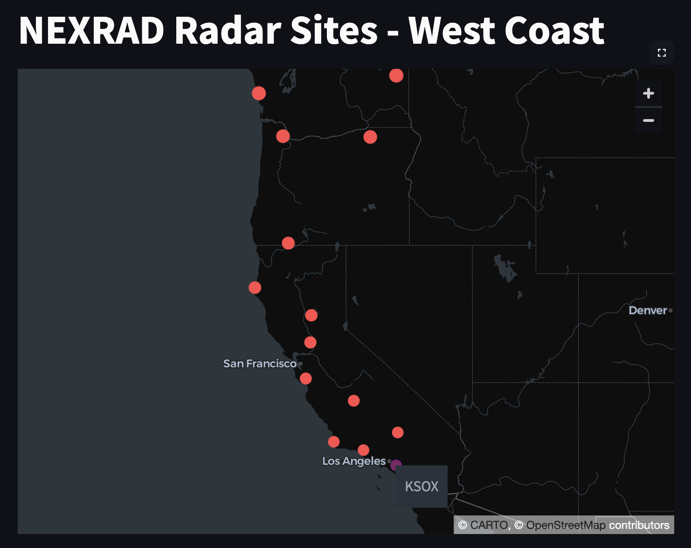
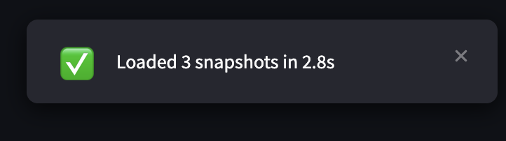
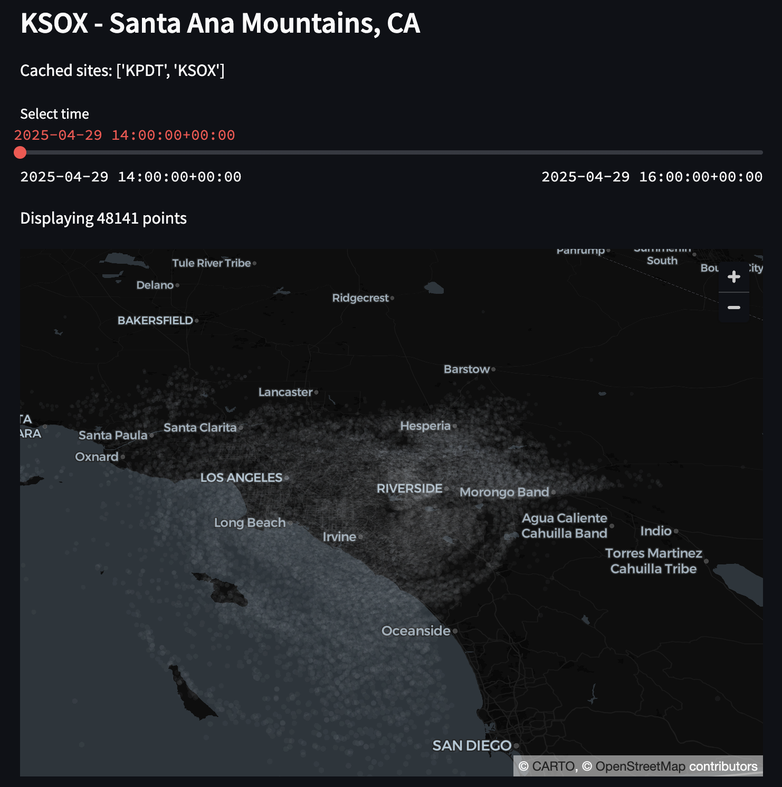

# NEXRAD Radar Visualization

## Technical Focus
We decided to go for a balanced full-stack approach, which included producing interactive visualizations on the frontend and robust data processing and caching in the backend.

## Data Access
NEXRAD Data: Retrieved from AWS OpenData using S3 (noaa-nexrad-level2).

## Architecture Overview
### Backend (``nexrad.py``, ``buffer.py``, ``reflectivity.py``)
1. Data Retrieval
    - Use ``fsspec`` to list hourly NEXRAD files for the past three hours (``get_hourly_nexrad_file_paths``).
2. Data Processing
    - Use PyART to extract reflectivity data (``get_nexrad_radar``). The results are cached using a TTL cache (``@st.cache_data``).
    - Convert radar sweeps to point cloud data (``nexrad_radar_to_reflectivity_snapshot``). Here we uniformly downsample the data, apply a reflectivity threshold, and finally store the results in lower precision in ``ReflectivitySnapshot`` dataclasses. The dataclass stores `site_id`, `lat`, `lon`, `alt`, `dBZ` for a given ``timestamp``.
3. Further Caching
    - **LRU Site Buffer**: ``NEXRADReflectivitySnapshotBuffer`` maintains a per-site buffer keyed by site ID (e.g. 'KPDT'). It uses an LRU policy to limit total memory footprint across all sites, dropping the oldest inactive site buffer when a size threshold is exceeded.
    - **Snapshot Deque**: For each site, a thread-safe deque holds the most recent N snapshots (default 3 hours). 
    - **Cache Miss Handling**: On cache miss, the buffer fetches and processes radar data, populating the deque before returning the first snapshot.

### Frontend (``app.py``, ``app_util.py``)
1. Site Selection
    - We load west coast radar site metadata (lat, lon, etc.) from ``raw_data/nexrad_wc_sites.csv``.
    - Displays a scatterplot of sites, allowing users to select one to view.
2. Reflectivity Viewer
    - Upon site selection, loads cached snapshots and constructs dataframes.
    - Renders a point cloud with RGBA values mapped from dBZ.
    - Provides a slider to navigate hourly snapshots.

## Time and Scope
- **Development Time**: approx. 12 hours
- **Use Cases**:
    - As per my understanding, weather conditions have to be constantly monitored in order to determine the optimal time to conduct a seeding run, not just in one area but across the United States. With this application, we are able to view the reflectivity at many sites across timesteps in order to better track the evolving conditions and identify favorable seeding windows in near real time.
- **Scope Decisions**:
    - Limited radar sites to only west coast. 
    - Used Streamlit to cut down on frontend dev time since it integrates seamlessly into the Python ecosystem.
    - Prioritized displaying reflectivity data and caching mechanism.

## Production Considerations
Given additional time and resources:

- Data retrieval and processing pipelines
    - Support for other NEXRAD/SNOTEL products.
    - Apache Kafka for reliable file processing, decoupled from the rest of the app.
    - Robust data validation (pydantic, pandera etc.) and logging.
    - Implement adaptive downsampling to downsample more aggressively in dense reflectivity regions.
    - Implement interpolation between snapshots for a more continuous view of changing cloud conditions.
- Caching
    - Extend buffer class to handle other NEXRAD products.
    - Use a distributed cache service (e.g. Redis) to reduce reliance on Streamlit caches.
    - Pre-fetch high demand site snapshots.
- Frontend
    - Build frontend as a React/Next.js app, which would offer better performance compared to Streamlit.


## Setup and Usage

```
# Clone repository
git clone https://github.com/psjcodes/making-rain.git
cd making-rain

# Create virtual environment (optional)
python3 -m venv venv
source venv/bin/activate

# Install dependencies
pip install -r requirements.txt

# Run the app
streamlit run app.py
```

Select a radar site:


Wait for data to load:


Scroll down to view data from past 3 hours:
